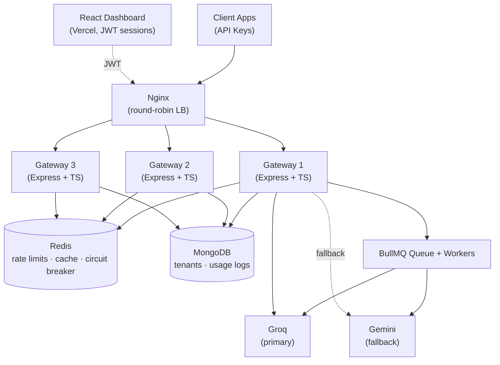

# Multi-Tenant LLM API Gateway

A production-style API gateway sitting between client applications and LLM providers (Groq, Gemini) — built to solve the real infrastructure problems any company faces when exposing LLM access to multiple tenants: **cost control, abuse prevention, and resilience.**

**This is not a chatbot project.** No chat UI ships as the product — the gateway infrastructure itself is what's being demonstrated. An interactive API Playground exists in the dashboard purely as a way to exercise and observe the gateway's behavior live.

---

## 🔗 Live Demo

| | |
|---|---|
| **Dashboard** | [https://llm-api-gateway-six.vercel.app/](https://llm-api-gateway-six.vercel.app/) |
| **API health check** | [http://44.216.227.72/v1/health](http://44.216.227.72/v1/health) |

Sign up for a free account on the dashboard, then use the built-in **API Playground** to send real requests and watch cache hits, provider routing, and rate-limit quota update live.

---

## What Problem This Solves

Any company building on top of an LLM provider eventually needs:

- **Cost control** — no single tenant can burn unlimited provider spend
- **Abuse prevention** — rate limits that hold correctly even under concurrent load and across multiple server instances, not just "usually work"
- **Resilience** — the system stays useful when an upstream provider degrades or goes down entirely

The single architectural decision everything else hangs on: **all shared state — rate-limit counters, cache, circuit-breaker flags — lives in centralized Redis, never in a gateway process's own memory.** This is what makes horizontal scaling *correct*, not just "technically running multiple copies."

---

## Architecture



**Request flow for `POST /v1/chat/completions`:**
Nginx → auth (API key → Redis cache-aside → Mongo fallback) → rate limiter (Redis Lua, sliding window) → cache check (Redis, SHA256 key) → circuit breaker check (per-provider) → upstream call (Groq, fallback Gemini) → async usage log.

---

## Tech Stack

| Layer | Choice |
|---|---|
| Language | TypeScript 5.6.3 |
| Framework | Express.js |
| Database | MongoDB (Mongoose) |
| Cache / Broker | Redis (ioredis) |
| Queue | BullMQ |
| Reverse Proxy | Nginx |
| Auth | JWT (dashboard) + API keys (gateway traffic) |
| Frontend | React + Vite + Tailwind + recharts |
| Testing | Jest, Supertest, mongodb-memory-server, k6 |
| Containers | Docker + docker-compose |
| Deployment | AWS EC2 (backend), Vercel (dashboard) |
| Upstream LLMs | Groq (primary), Gemini (fallback) |

---

## Core Design Principles

1. **No shared state in process memory** — rate limits, cache, and circuit breaker state all live in Redis
2. **Rate limiter uses an atomic Lua script (`EVAL`)** — never separate check-then-increment calls, which would race under concurrency
3. **Never store raw credentials** — bcrypt for passwords, SHA256 for API keys (deterministic, required for Redis cache-aside lookup — bcrypt's salting makes it unusable as a lookup key)
4. **Circuit breaker has exactly 3 states** — closed / open / half-open, with the half-open transition itself concurrency-guarded so only one trial request gets through
5. **Cache key = SHA256(prompt + model)**, deliberately shared across tenants — an LLM's response to identical input is deterministic content, not tenant-specific data
6. **All middleware independently unit-testable**
7. **Usage logging is async and non-blocking** — fires on `res.on('finish')`, never delays the response, failures are caught and logged rather than surfaced
8. **Redis key names as named constants**, shared between every module that reads or writes them — avoids the exact kind of key-mismatch bug documented below

---

## Load Test Results (k6, Phase 10)

| Test | Result |
|---|---|
| **Rate limiter atomicity** | 200 concurrent requests → exactly 100 passed, 100 denied, 0 server errors (p99: 105.85ms) |
| **Cache-hit capacity** | 500 concurrent VUs sustained, 856 req/sec throughput — p50: 2.11ms, p95: 3.75ms, **p99: 6.85ms** (target: <300ms) |
| **Circuit breaker** | Trips correctly after 5 real upstream failures; subsequent requests short-circuit in ~4-5ms instead of waiting on a failing provider |

**Real production evidence** (from live `UsageLog` data, not simulated): a genuine cache miss took **1166ms** (real Groq round-trip); the identical prompt on cache hit took **3ms** — a ~390x speedup, serving entirely from Redis with zero upstream call.

---

## Notable Engineering Challenges

A selection of real bugs found and fixed during development — chosen because each one reveals something about the system's actual behavior, not just a typo fix.

- **Redis lazy-singleton chicken-and-egg bug.** The Redis client was only ever instantiated inside a code path gated behind `isRedisAvailable()` — but nothing ever called the initializer *outside* that check.
  - Result: the client never got created, the check permanently returned false, and cache-aside silently no-op'd on every request, falling through to MongoDB every time, with zero errors thrown.
  - Caught by manually inspecting Redis with `redis-cli KEYS` and finding it empty despite requests succeeding — not by any automated test, which led directly to the next fix.

- **A passing test suite that couldn't have caught the bug above.** The auth middleware's tests had a graceful-degradation fallback that let them pass even without a live Redis connection.
  - Meaning: the suite would have stayed green even if the bug above recurred.
  - Fixed by adding a hard `redis.ping()` check in test setup, so the suite now fails loudly if Redis isn't genuinely connected.

- **`tsc` doesn't copy non-TypeScript files.** The rate limiter and circuit breaker's Lua scripts live in `src/lua/`, but the TypeScript compiler only emits `.ts` output — it silently leaves `.lua` files behind.
  - Invisible locally (dev mode runs directly against `src/`), but every containerized instance crashed on startup with `ENOENT` the first time this ran inside Docker.
  - Fixed by adding an explicit copy step to the build.

- **Docker Compose's array-merge behavior.** An attempt to harden production by overriding `ports: []` for Redis/MongoDB in a second compose file silently did nothing.
  - Root cause: Compose *concatenates* array fields like `ports` across merged files rather than replacing them.
  - Fix: make the base compose file secure by default (no port publishing at all), and add ports back only in a separate dev-only override.

- **A feature masked by its own mock data.** A dashboard showing identical usage numbers (`1,420` requests, `68.4%` cache rate) regardless of which tenant logged in.
  - Turned out to be catching a 404 from a never-implemented backend endpoint and silently falling back to hardcoded placeholder data.
  - The real `UsageLog` pipeline had never been built — a `TODO` comment sat unimplemented since an earlier phase.
  - Building it surfaced a second bug: the async worker path was writing every usage record with `tokensUsed: 0`, caught by a test assertion before it reached production analytics.

- **Model identifiers are provider-controlled and can go stale without warning.** Mid-project, both Groq and Gemini deprecated the specific model names this gateway had been using — independent of any code change here.
  - Fixed by querying each provider's live model-list endpoint with real API keys rather than trusting documentation, and switching to their currently-recommended replacements.

---

## Getting Started (Local)

```bash
git clone https://github.com/<your-username>/llm-api-gateway.git
cd llm-api-gateway
cp gateway/.env.example gateway/.env   # add your own GROQ_API_KEY / GEMINI_API_KEY
docker-compose -f docker-compose.yml -f docker-compose.dev.yml up -d --build
```

Gateway available at `http://localhost:8080`. Run the dashboard separately:

```bash
cd dashboard
npm install
npm run dev
```

Run the test suite:

```bash
cd gateway
npm test
```

---

## API Overview

| Endpoint | Auth | Description |
|---|---|---|
| `POST /auth/signup` | — | Create tenant, receive API key (shown once) |
| `POST /auth/login` | — | Dashboard session JWT |
| `POST /v1/chat/completions` | API key | Synchronous chat completion |
| `POST /v1/chat/completions?async=true` | API key | Enqueue async job, returns `202 {jobId}` |
| `GET /v1/jobs/:jobId` | API key | Poll async job result |
| `GET /dashboard/usage` | JWT | Per-tenant usage analytics |
| `GET /dashboard/limits` | JWT | Current rate-limit window state |
| `POST /dashboard/playground` | JWT | Test endpoint used by the dashboard's API Playground |

---

## Known Limitations

- **No TLS on the EC2 backend itself** — the gateway serves plain HTTP. The Vercel-hosted dashboard works around this via server-side rewrite proxying (browser talks HTTPS to Vercel only), but a direct API consumer would need to add their own TLS termination in front of this deployment for production use.
- **Model identifiers require manual updates** when providers deprecate them — no automated health check currently validates configured model names against each provider's live model list.
- **Free-tier AWS deployment** — running on a `t3.micro` with a time-limited free-tier credit window, not intended as a permanently-available production endpoint.

---

## Testing

11 test suites, 65+ tests, covering: auth flows, API key issuance and rotation, Redis cache-aside behavior (including forced-degradation paths), sliding-window rate limiter atomicity under concurrency, response caching, circuit breaker state transitions (including the half-open concurrency boundary), upstream provider fallback, async job processing, and usage-log correctness.

```bash
cd gateway && npm test
```
